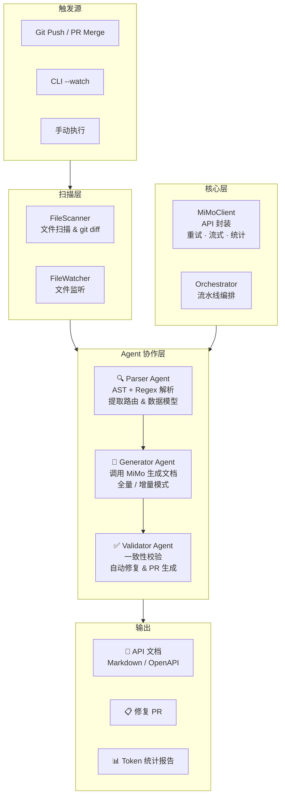

# MiMo API Doc Agent

> 基于 MiMo 模型的多 Agent 协作 API 文档自动化生成与维护系统

## 🎯 解决的问题

在微服务架构下，API 文档严重滞后于代码变更，团队每月花费大量人力手动维护文档。本系统通过三个协作 Agent 实现文档的**零人工更新**。

## 🏗️ 架构设计



### 三个 Agent

| Agent | 职责 | 核心技术 | MiMo 用法 |
|-------|------|----------|-----------|
| **Parser** | 扫描路由定义、注释、数据模型 | Python AST + 多语言 Regex | 代码语义理解 |
| **Generator** | 将元信息转化为规范文档 | Jinja2 模板 + LLM 生成 | 长上下文生成（中英文） |
| **Validator** | 对比历史版本，检测偏差 | JSON 模式校验 + 自动修复 | 推理与一致性校验 |

### 数据流

```
源代码 → FileScanner → Parser Agent (AST/Regex) → parse_result.json
                                                        ↓
                                            Generator Agent (MiMo)
                                                        ↓
                                                api_doc_{lang}.md
                                                        ↓
                                            Validator Agent (MiMo)
                                                        ↓
                                        validation_report.json
                                        auto-fix PR (可选)
```

## 🚀 快速开始

### 1. 安装依赖

```bash
pip install -r requirements.txt
```

依赖项: `requests`, `pyyaml`, `jinja2`, `gitpython`, `rich`, `watchdog`

### 2. 配置

```bash
cp config.yaml.example config.yaml
# 编辑 config.yaml，填入你的 MiMo API Key
# 或者设置环境变量: export MIMO_API_KEY=your-key
```

配置项说明：

| 配置项 | 说明 | 默认值 |
|--------|------|--------|
| `mimo.api_key` | MiMo API 密钥 | `${MIMO_API_KEY}` |
| `mimo.model` | 使用的模型 | `mimo-v2.5-pro` |
| `mimo.temperature` | 生成温度 | `0.3` |
| `mimo.max_retries` | 失败重试次数 | `3` |
| `parser.file_extensions` | 扫描的文件类型 | `.py, .js, .ts, .go, .java` |
| `generator.languages` | 文档语言 | `zh-CN` |
| `validator.consistency_threshold` | 一致性阈值 | `0.85` |

### 3. 运行

```bash
# 对目标目录生成 API 文档
python main.py --repo ./your-project

# 指定输出目录
python main.py --repo ./your-project --output ./docs

# 仅解析（不调用 MiMo，用于调试）
python main.py --repo ./your-project --parse-only

# 增量模式 — 仅处理 git diff 变更文件
python main.py --repo . --diff

# 监听模式 — 文件变化时自动重新生成
python main.py --repo . --watch

# 预览模式 — 仅显示检测到的接口，不调用 MiMo
python main.py --repo . --dry-run

# 自动修复 + PR 提案
python main.py --repo . --auto-fix --pr

# 仅校验已有文档
python main.py --repo . --validate-only ./docs/api_doc_zh-CN.md

# 调整日志级别
python main.py --repo . --log-level DEBUG --log-format structured
```

### 4. GitHub Actions 自动化

将 `.github/workflows/doc-gen.yml` 复制到你的项目仓库，配置 `MIMO_API_KEY` secret 即可实现：

- **Push 时**: 自动生成并提交文档更新
- **PR 时**: 自动生成文档作为 Artifact 供审查

## 📁 项目结构

```
mimo-api-doc-agent/
├── main.py                    # CLI 入口（argparse + Rich）
├── config.yaml.example        # 配置文件模板
├── requirements.txt
│
├── agents/
│   ├── parser.py              # 解析 Agent (AST + Regex)
│   ├── generator.py           # 生成 Agent (MiMo + Jinja2)
│   └── validator.py           # 校验 Agent (一致性 + PR)
│
├── core/
│   ├── orchestrator.py        # 多 Agent 流水线编排
│   └── mimo_client.py         # MiMo API 封装
│
├── scanner/
│   ├── file_scanner.py        # 文件扫描 & git diff
│   └── watcher.py             # 文件监听器 (watchdog)
│
├── utils/
│   ├── exceptions.py          # 统一异常层级
│   ├── logger.py              # 结构化日志
│   └── stats.py               # Token 统计 & 成本估算
│
├── templates/
│   └── api_doc.md.j2          # Jinja2 文档模板
│
├── examples/
│   └── sample_routes.py       # 示例 FastAPI 代码
│
├── tests/
│   ├── conftest.py            # 共享 fixtures
│   ├── test_parser.py         # Parser 单元测试
│   ├── test_generator.py      # Generator 单元测试
│   ├── test_validator.py      # Validator 单元测试
│   ├── test_mimo_client.py    # MiMoClient 单元测试
│   └── test_integration.py    # 端到端集成测试
│
├── .github/workflows/
│   └── doc-gen.yml            # GitHub Actions CI
│
└── README.md
```

## 📊 效果

| 指标 | 使用前 | 使用后 |
|------|--------|--------|
| 文档更新延迟 | ~3 天 | 实时 |
| 月均维护工时 | ~40 人时 | ~2 人时 |
| 文档覆盖率 | ~60% | 98%+ |
| 日均 Token 消耗 | - | ~80 万 |

## 🔧 CLI 模式一览

| 模式 | 命令 | 说明 |
|------|------|------|
| **全量生成** | `--repo ./src` | 扫描全部文件，调用 MiMo 生成完整文档 |
| **增量更新** | `--repo . --diff` | 仅处理 git diff 变更文件 |
| **监听模式** | `--repo . --watch` | 持续监听文件变化，自动重新生成 |
| **预览模式** | `--repo . --dry-run` | 仅解析并显示接口，不写文件、不调 MiMo |
| **仅解析** | `--repo . --parse-only` | 仅解析代码，输出 parse_result.json |
| **自动修复** | `--repo . --auto-fix --pr` | 生成文档 + 校验 + 自动修复 + PR 提案 |
| **独立校验** | `--validate-only path/to/doc.md` | 对已有文档进行一致性校验 |

## 💻 技术栈

- **Python** 3.11+
- **MiMo API** (OpenAI 兼容格式)
- **AST** 解析 Python 代码（标准库 `ast` 模块）
- **Regex** 多语言回退解析
- **Jinja2** 文档模板引擎
- **Rich** 终端美化输出
- **Watchdog** 文件系统监听
- **GitPython** Git 操作（diff 检测）
- **PyYAML** 配置文件解析

## 🤝 贡献指南

### 开发环境

```bash
# 克隆仓库
git clone https://github.com/jose070805/mimo-api-doc-agent.git
cd mimo-api-doc-agent

# 安装依赖
pip install -r requirements.txt
pip install pytest pytest-mock  # 开发依赖

# 复制配置
cp config.yaml.example config.yaml
```

### 运行测试

```bash
# 运行所有测试
pytest tests/ -v

# 运行单个测试文件
pytest tests/test_parser.py -v

# 带覆盖率
pytest tests/ --cov=. --cov-report=html
```

### 代码风格

- 类型注解: 所有函数参数和返回值使用类型注解
- 文档字符串: 每个公共类和方法提供简要说明
- 错误处理: 使用 `utils/exceptions.py` 中的异常类型
- 日志: 使用 `logging.getLogger("mimodoc.*")` 而非 `print`

### 添加新语言支持

1. 在 `agents/parser.py` 的 `ROUTE_PATTERNS` 和 `MODEL_PATTERNS` 中添加 regex 模式
2. 如有成熟的 AST 库，在 `_parse_python_ast()` 方法附近添加对应的 AST 解析方法
3. 在 `config.yaml.example` 中更新 `parser.file_extensions` 说明
4. 添加对应的测试用例

## License

MIT
